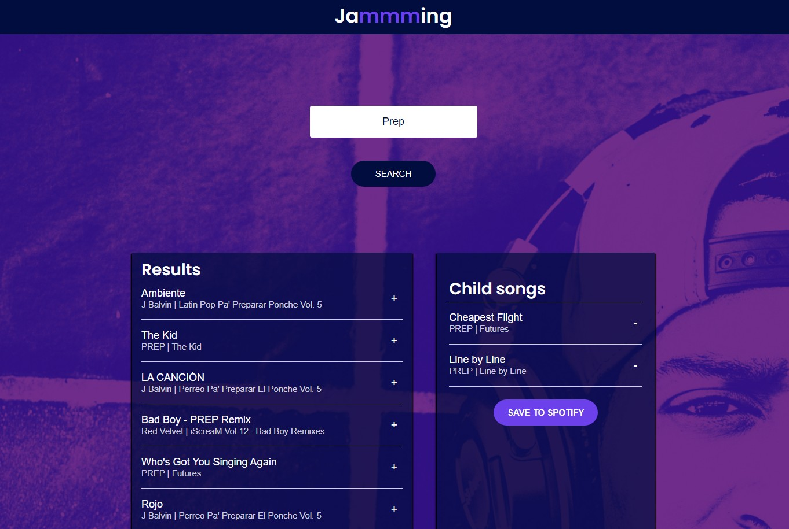
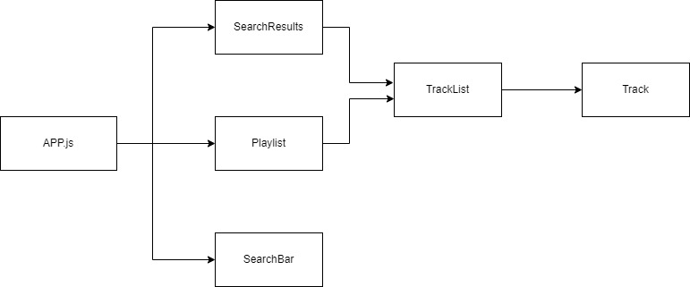
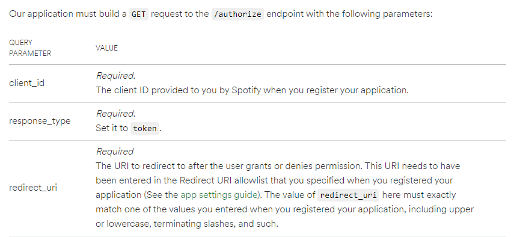

<h1 align="center">Welcome to Jammming 👋</h1>
<p>
  
</p>

> Assignment project from Generation Thailand in Junior Software Developer Bootcamp (Source problem from codecademy) 

### 🏠 [Homepage](http://jammming-tee.surge.sh/)
Currently My Spotify API is currently Development mode. <br />
If you want to use or test it, Please send your spotify email to me in ganchana78@gmail.com .

## Jammming


# Function : Create a new playlist that you wanted and save it to your spotify account

## Program structure :


* In App.js have 4 main functions 
  * addTrack() for add track that you want to save in your playlist 
    => Pass this function to use in Track component
  * removeTrack() for remove track that you added in your playlist 
    => Pass this function to use in Track component
  * search() for search tracks that match with your search term 
    => Call function from Spotify.js 
    =>  Pass this function to use in SearchBar component
  * savePlaylist for save playlist that you build in this website to your spotify 
    => Call function in Spotify.js 
    =>  Pass this function to use in Playlist component
  
  In Tracklist component it recieve attributes from SearchResults and Playlist. seperated by is isRemoval conditions.
If isRemoval is true, it from Playlist. else it from SearchResults

* Spotify API in Spotify.js have 3 functions in class component
  * getAccessToken : get access token to have permission in spotify account
    
    Send request to spotifyURL that follow spotify doc with playlist-modify-public in added parameter <br />
    REF: https://developer.spotify.com/documentation/general/guides/authorization/implicit-grant/
         https://developer.spotify.com/documentation/general/guides/authorization/scopes/#playlist-modify-public

  * search : GET track that match with your input term in spotify <br />
    REF: https://developer.spotify.com/documentation/web-api/reference/#/operations/search

  * savePlaylist : POST new playlist that you created nad PUT track to this playlist <br />
    REF: https://developer.spotify.com/documentation/web-api/reference/#/operations/create-playlist
         https://developer.spotify.com/documentation/web-api/reference/#/operations/reorder-or-replace-playlists-tracks

## Install

```sh
npm install
```

## Usage

```sh
npm run start
```

## Author

👤 **Ganchana Youpaisan(Tee)**

* Github: [@GanchanaTee](https://github.com/GanchanaTee)
* LinkedIn: [@Ganchana Youpaisan](https://www.linkedin.com/in/ganchana-youpaisan-757823166)

## Show your support

Give a ⭐️ if this project helped you!

***
_This README was generated with ❤️ by [readme-md-generator](https://github.com/kefranabg/readme-md-generator)_